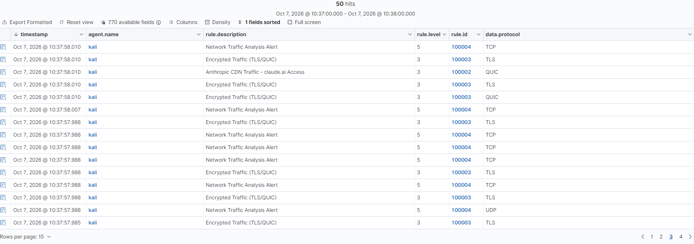

# Case 3: Wireshark-to-Wazuh Automation

**Date:** 03-10-2026 to 07-10-2026 | **Status:** ingestion, protocol extraction and custom rules fully validated against live traffic; custom dashboard pending

## Objective

Capture network traffic automatically with tshark and bring it into the Wazuh SIEM as alerts, using custom detection rules.

## Architecture

tshark (60 s capture)
-> Python parser (random sample, up to 50 IP packets)
-> wireshark_events.json (one JSON object per line, append mode)
-> Wazuh Agent (localfile, json)
-> Wazuh Manager (custom rules 100000-100004)
-> Wazuh Dashboard


## Components

| Component | Location | Role |
|-----------|----------|------|
| Capture and parsing script | `scripts/wireshark_to_wazuh.py` | Runs tshark, extracts fields, samples events, appends them to the log file |
| Detection rules | `config/wazuh_rules.xml` | Custom rules 100000-100004 (loaded in the Manager as `0100-wireshark_network_analysis.xml`) |
| Agent configuration | `/var/ossec/etc/ossec.conf` (Kali) | `<localfile>` block that monitors the log file |

### Event format

Each line of the log file is a complete JSON object:

```json
{"timestamp": "2026-10-06T21:33:58.986104+00:00", "event_type": "network_traffic", "src_ip": "54.187.119.242", "dst_ip": "192.168.0.15", "protocol": "TLS", "dst_port": "4918", "frame_length": "85"}
```

`protocol` is the highest-level protocol dissected by tshark (TLS, QUIC, DNS, MDNS, ICMP, UDP, TCP, ...), not a guess based on the destination port.

### Agent configuration

```xml
<localfile>
  <location>/home/kali/wireshark_logs/*.json</location>
  <log_format>json</log_format>
  <label key="event_type">network_traffic</label>
</localfile>
```

## Setup

**Requirements:** Kali Linux, tshark, Python 3 with `python-dotenv`, Wazuh Manager 4.14.x and a Wazuh Agent on the capture machine. A fixed IP for each machine is recommended (see `docs/fixed-ip-setup.md`); if the host moves to a different Wi-Fi network or access point, the fixed IPs may stop being reachable (see Known issues below).

1. Create `config/config.env` (not committed):

CAPTURE_DURATION=60
CAPTURE_INTERFACE=eth0
LOG_DIR=/home/kali/wireshark_logs

2. Create the log file once and add the `<localfile>` block to the agent's `ossec.conf`:
```bash
   sudo touch /home/kali/wireshark_logs/wireshark_events.json
   sudo systemctl restart wazuh-agent
```
3. On the Manager, write `/var/ossec/etc/rules/0100-wireshark_network_analysis.xml` with the content of `config/wazuh_rules.xml`, validate it, then restart:
```bash
   sudo /var/ossec/bin/wazuh-analysisd -t
   sudo systemctl restart wazuh-manager
```
4. Run the capture (tshark needs root):
```bash
   cd scripts/
   sudo python3 wireshark_to_wazuh.py
```

## Rules

| Rule ID | Description | Level | Parent | Matches on |
|---------|-------------|-------|--------|------------|
| 100000 | Decodes `network_traffic` JSON events | 0 | (decoder) | `event_type` field |
| 100004 | Network traffic analysis alert (generic) | 5 | 100000 | anything not matched below |
| 100001 | Cloudflare CDN, destination `162.159.141.124` | 3 | 100004 | `dst_ip` field (exact) |
| 100002 | Anthropic CDN, destination `160.79.104.10` | 3 | 100004 | `dst_ip` field (exact) |
| 100003 | Encrypted traffic (TLS/QUIC) | 3 | 100004 | raw log text, regex (see below) |

## Results

### 1. Ingestion validated (03-10-2026)

- 60 s capture on `eth0`: 13,363 packets, 50 events written (50 lines in the log file).
- Dashboard, filter `data.event_type: network_traffic`: **50 hits**, matching `rule.id: (100001 OR 100002 OR 100003 OR 100004)`.

### 2. Protocol extraction rewritten (03-10-2026)

The first version of the script labeled every packet as `HTTPS` (destination port 443) or `TCP` (everything else), and kept non-IP packets (ARP) as `N/A` events. It also always kept the first 50 packets of a capture rather than a representative sample.

The script was rewritten to:
- Read the real protocol tshark dissected (`frame.protocols`), giving values like `TLS`, `QUIC`, `DNS`, `MDNS`, `ICMP`, `UDP`, `TCP`.
- Drop packets with no IP layer instead of saving them as `N/A`.
- Take a random sample of up to 50 IP packets from the whole capture, not just the first 50.

### 3. Timestamp parsing bug (06-10-2026)

After the rewrite, a 60 s capture with 831 packets produced **0 sampled events** ("No IP packets captured"). The cause: this tshark version emits `frame.time_epoch` as an ISO string (`"2026-10-06T20:47:32.102781963Z"`), not as a Unix epoch float as assumed. Converting it with `float(...)` raised an exception on every single packet, silently caught by a broad `except Exception: continue`, so nothing was ever saved.

Fixed with `parse_frame_time()`, which tries the ISO format first and falls back to a numeric epoch for compatibility with other tshark versions. Verified in Kali: 792 IP packets found out of 831 captured, 50 sampled, real protocol variety (TCP, QUIC, TLS, UDP, SSDP, DNS), 0 `N/A` events.

### 4. Rule 100003 did not fire on live traffic (06-10-2026 to 07-10-2026)

With the script fixed, live captures kept containing TLS/QUIC events, but rule 100003 never appeared in the Dashboard; every encrypted-traffic event was falling through to the generic rule 100004.

**Diagnosis**, using `sudo /var/ossec/bin/wazuh-logtest` and a real alert pulled from `/var/ossec/logs/alerts/alerts.json`:

- A manually typed test event (with a space after each `:`) correctly fired rule 100003 in `wazuh-logtest`.
- The real `full_log` of a live alert showed `"protocol":"TLS"`, **with no space** after the colon — unlike the default output of Python's `json.dumps()`, which does add one. Something in the agent/Manager pipeline normalizes this spacing before it reaches `full_log`; the original rule's `<match>"protocol": "TLS"|...</match>` required the space and therefore never matched real events.
- An attempt to fix this by matching the already-decoded field instead of raw text (`<field name="protocol" type="pcre2">^(TLS|QUIC)$</field>`) failed Manager-side validation with `ERROR: Failure to read rule 100003. Field 'protocol' is static.`

**Fix:** match the raw log with a regex that tolerates both spacings:

```xml
<rule id="100003" level="3">
  <if_sid>100004</if_sid>
  <match type="pcre2">"protocol":\s*"(TLS|QUIC)"</match>
  <description>Encrypted Traffic (TLS/QUIC)</description>
  <group>network_traffic,encrypted_traffic,</group>
</rule>
```

**Validation**, with `wazuh-analysisd -t` passing and `wazuh-logtest` firing 100003 for both spacings, then confirmed against a live 50-event capture exported from the Dashboard:

| `rule.id` | Count | `data.protocol` breakdown |
|-----------|-------|----------------------------|
| 100003 | 17 | 15 TLS, 2 QUIC |
| 100004 | 32 | 25 TCP, 5 UDP, 1 MDNS, 1 IGMP |
| 100002 | 1 | 1 QUIC, to the exact Anthropic IP |

All 50 events are accounted for (17 + 32 + 1), with no overlap: the single QUIC event to `160.79.104.10` correctly matched the more specific rule 100002 before reaching 100003, exactly as the parent/child hierarchy is designed to behave.



## Lessons learned

1. **The `json` log format needs one complete JSON object per line.** A pretty-printed array (`json.dump(..., indent=2)`) cannot be decoded line by line by the Wazuh logcollector.
2. **The agent picked up lines appended to a monitored file, not files that appeared already complete.** A new file per run produced no events; a single file opened in append mode did.
3. **A catch-all rule can hide more specific sibling rules.** Making the generic rule the parent and the specific rules its children fixed it.
4. **Never assume the exact byte format of a value tshark emits.** `frame.time_epoch` changed from a numeric epoch to an ISO string between what was assumed and what this tshark version actually outputs; a broad `except Exception: continue` turned that mismatch into a silent "0 events" failure instead of a visible error.
5. **The text reaching `full_log` is not guaranteed to match the script's `json.dumps()` output byte for byte.** Whitespace was lost somewhere in the agent/Manager pipeline; raw-text `<match>` rules should tolerate spacing variations (`\s*`) rather than assume one exact format.
6. **Not every decoded field can be used with `<field type="pcre2">`.** `wazuh-analysisd` rejected `protocol` as "static"; matching the raw log with `<match type="pcre2">` worked instead.
7. **`wazuh-logtest` validates a rule in isolation; it does not prove the live pipeline behaves the same way.** The 100003 bug only showed up by comparing a real alert's `full_log` against a manually typed test case.
8. **Alerts below `log_alert_level` (3 by default) are not indexed.** Rules meant to be visible need level 3 or higher.
9. **A fixed IP is only valid on the network it was configured for.** Moving between Wi-Fi access points (e.g. a router and its own range extender) can place the host on a different subnet, breaking connectivity to VMs with statically assigned addresses until the host reconnects to the original network.
10. **Separate ingestion problems from rule problems.** If events are missing from `wazuh-alerts-*`, check `wazuh-archives-*` (with `logall` enabled): events there but not in alerts point to the rules; events in neither point to the agent.

## Known limitations

- Rules 100001 and 100002 match one exact destination IP each, so they rarely fire against real traffic. Matching IP ranges with a regex would cover more traffic.
- An event that matches two child rules at once in a way not covered by the hierarchy (for example HTTPS-labeled traffic to the Cloudflare IP under the old port-based labeling) was not retested after the protocol rewrite.
- The log file grows with every run (about 10 KB per execution); no rotation is in place.

## Known issues (environment)

- **DHCP / Wi-Fi roaming:** when the host machine's Wi-Fi reconnects to a different access point (even on the same network, such as a router's own range extender), the VMs' bridged adapter can lose IPv4 connectivity or receive a different address, breaking both the agent-to-Manager connection and Dashboard access. Reserving each VM's IP by MAC address in the router is more reliable than a static IP set inside the VM.
- **Services not surviving a host suspend/resume:** after the host machine was suspended or lost network connectivity, `wazuh-indexer` was found `failed` while `wazuh-manager` and `wazuh-dashboard` still reported `active`, causing the Dashboard to return HTTP 503. Checking `systemctl is-active wazuh-indexer` is the fastest way to confirm this before assuming a network issue.

## Next steps

- Build the custom dashboard: events over time, top destination IPs, protocol distribution, detections per rule.
- Schedule the capture with cron.
- Revisit rules 100001/100002 to match CIDR ranges instead of single IPs.

## Security notes

- `config.env` is excluded through `.gitignore`.
- Private IPs in this document are generic (`192.168.0.x`); screenshots must have private IPs, agent names and SSIDs blurred.
- Packet captures (`.pcap`, `.pcapng`) are never committed.