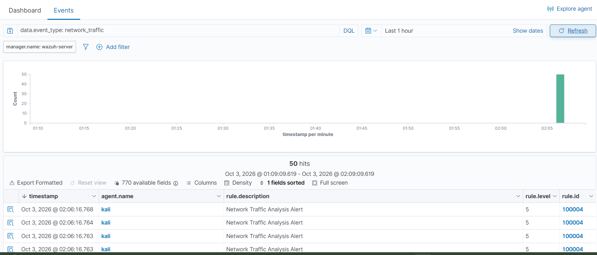
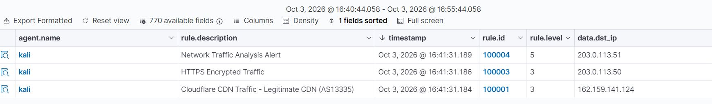

# Case 3: Wireshark-to-Wazuh Automation

**Date:** 03-10-2026 | **Status:** ingestion and custom rules validated, custom dashboard pending

## Objective

Capture network traffic automatically with tshark and bring it into the Wazuh SIEM as alerts, using custom detection rules.

## Architecture

tshark (60 s capture)
-> Python parser (first 50 packets)
-> wireshark_events.json (one JSON object per line, append mode)
-> Wazuh Agent (localfile, json)
-> Wazuh Manager (custom rules 100000-100004)
-> Wazuh Dashboard


## Components

| Component | Location | Role |
|-----------|----------|------|
| Capture and parsing script | `scripts/wireshark_to_wazuh.py` | Runs tshark, extracts fields, appends events to the log file |
| Detection rules | `config/wazuh_rules.xml` | Custom rules 100000-100004 (loaded in the Manager as `0100-wireshark_network_analysis.xml`) |
| Agent configuration | `/var/ossec/etc/ossec.conf` (Kali) | `<localfile>` block that monitors the log file |

### Event format

Each line of the log file is a complete JSON object:

```json
{"timestamp": "2026-10-03T02:06:16.123456", "event_type": "network_traffic", "src_ip": "192.168.0.10", "dst_ip": "172.67.157.37", "protocol": "HTTPS", "dst_port": "443", "frame_length": "1507"}
```

### Agent configuration

```xml
<localfile>
  <location>/home/kali/wireshark_logs/*.json</location>
  <log_format>json</log_format>
  <label key="event_type">network_traffic</label>
</localfile>
```

## Setup

**Requirements:** Kali Linux, tshark, Python 3 with `python-dotenv`, Wazuh Manager 4.14.x and a Wazuh Agent on the capture machine. A fixed IP for each machine is recommended (see `docs/fixed-ip-setup.md`).

1. Create `config/config.env` (not committed):

CAPTURE_DURATION=60
CAPTURE_INTERFACE=eth0
LOG_DIR=/home/kali/wireshark_logs

2. Create the log file once and add the `<localfile>` block to the agent's `ossec.conf`:
```bash
   sudo touch /home/kali/wireshark_logs/wireshark_events.json
   sudo systemctl restart wazuh-agent
```
3. In the Dashboard, go to Management > Rules > Custom rules, create `0100-wireshark_network_analysis.xml` with the content of `config/wazuh_rules.xml`, then restart the Manager.
4. Run the capture (tshark needs root):
```bash
   cd scripts/
   sudo python3 wireshark_to_wazuh.py
```

## Rules

| Rule ID | Description | Level | Parent |
|---------|-------------|-------|--------|
| 100000 | Decodes `network_traffic` JSON events | 0 | (decoder) |
| 100004 | Network traffic analysis alert (generic) | 5 | 100000 |
| 100001 | Cloudflare CDN, destination `162.159.141.124` | 3 | 100004 |
| 100002 | Anthropic CDN, destination `160.79.104.10` | 3 | 100004 |
| 100003 | HTTPS encrypted traffic | 3 | 100004 |

## Results

### 1. Ingestion validated

- 60 s capture on `eth0`: 13,363 packets, 50 events written (50 lines in the log file).
- Dashboard, filter `data.event_type: network_traffic`: **50 hits**.
- Dashboard, filter `rule.id: (100001 OR 100002 OR 100003 OR 100004)`: **50 hits**.



### 2. Problem found: a generic rule hid the specific ones

In the first version all rules were siblings (`if_sid 100000`) and rule 100004 had no conditions of its own. The exported Events view showed **all 50 alerts as rule 100004**, although 8 of the 50 events contained HTTPS and should have matched rule 100003.

### 3. Fix: parent and child rules

Rule 100004 became the generic parent, and rules 100001-100003 became its children (`if_sid 100004`). Rule 100003 was also raised to level 3 so that it is indexed.

### 4. Validation with controlled events

Three synthetic events were appended to the log file (documentation range `203.0.113.0/24` plus the Cloudflare IP):

| Event | Expected rule |
|-------|---------------|
| `dst_ip` 162.159.141.124, TCP | 100001 |
| `dst_ip` 203.0.113.50, HTTPS | 100003 |
| `dst_ip` 203.0.113.51, TCP port 8080 | 100004 |

The three events produced three different alerts, one per rule (100001, 100003 and 100004).



## Lessons learned

1. **The `json` log format needs one complete JSON object per line.** The first version wrote a pretty-printed array (`json.dump(..., indent=2)`), which the Wazuh logcollector cannot decode line by line. Writing one object per line fixed the decoding.
2. **The agent picked up lines appended to a monitored file, not files that appeared already complete.** A new file per run produced no events; a single file opened in append mode did.
3. **A catch-all rule can hide more specific sibling rules.** Making the generic rule the parent and the specific rules its children fixed it. Always test each rule with a controlled event.
4. **Alerts below `log_alert_level` (3 by default) are not indexed.** Rules meant to be visible need level 3 or higher.
5. **Free-text searches can mislead.** Searching for the word "wireshark" returned `sudo` alerts, because the command line contains that word. Filter by `rule.id` or `data.*` fields instead.
6. **Separate ingestion problems from rule problems.** If events are missing from `wazuh-alerts-*`, check `wazuh-archives-*` (with `logall` enabled): events there but not in alerts point to the rules; events in neither point to the agent.

## Known limitations

- Rules 100001 and 100002 match one exact destination IP each, so they rarely fire against real traffic. Matching IP ranges with a regex would cover more traffic.
- An event that matches two child rules at once (for example HTTPS traffic to the Cloudflare IP) was not tested, so which rule wins is not documented.
- The script keeps the first 50 packets of each capture, not a representative sample.
- Packets without an IP layer (ARP, for example) are saved as `N/A` events and add no value.
- The log file grows with every run (about 10 KB per execution).

## Next steps

- Test an event that matches two child rules, and validate rule evaluation with `wazuh-logtest`.
- Filter out non-IP packets and improve event sampling.
- Build the custom dashboard: events over time, top destination IPs, protocol distribution, detections per rule.
- Schedule the capture with cron.

## Security notes

- `config.env` is excluded through `.gitignore`.
- Private IPs in this document are generic (`192.168.0.x`); screenshots must have private IPs, agent names and SSIDs blurred.
- Packet captures (`.pcap`, `.pcapng`) are never committed.